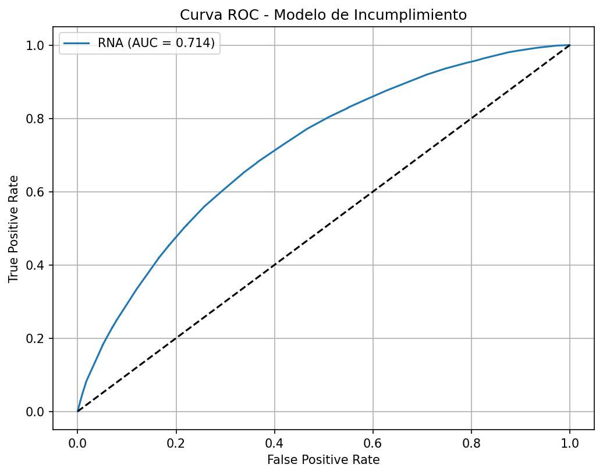
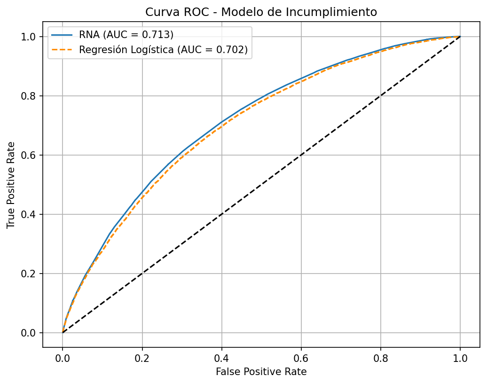
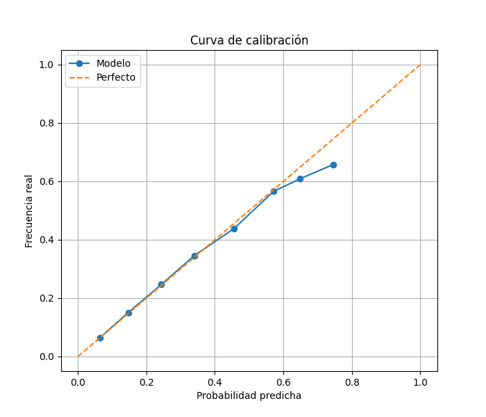

# Modelación de Riesgo de Crédito con Red Neuronal Calibrada y Score Derivado

---

**Jean Carlos Perilla Garcia  -** mailto:emmejiaa@unal.edu.co

**Emmanuel Alberto Mejia Arango -** mailto:emmejiaa@unal.edu.co

Juan Camilo López Morales - **mailto:jlopezmor@unal.edu.co**

---

**Link de pagina web del modelo**

[https://neuroscore-vdbvsqvefvuev3mu2em8ma.streamlit.app/](https://neuroscore-vdbvsqvefvuev3mu2em8ma.streamlit.app/) 

Nota: En el link se encuentra un apartado al lado derecho de la pagina web donde se encuentra el link del repositorio de Github del proyecto y video promocional junto los reportes sustentados individualmente.  

---

## **Resumen**

En este trabajo se desarrolla un modelo supervisado para estimar la probabilidad de incumplimiento crediticio (Probability of Default, PD) utilizando el *Credit Risk Dataset*. Se implementa una red neuronal artificial optimizada mediante búsqueda de hiperparámetros, la cual es comparada con un modelo base de regresión logística.

El modelo final alcanza un AUC de **0.7143**, mostrando una mejora moderada frente al baseline (**0.702**). A partir de la probabilidad estimada, se construye un score crediticio basado en log-odds, el cual permite ordenar individuos según su nivel de riesgo.

Finalmente, se desarrolla una aplicación web que permite estimar el riesgo individual y compararlo con la población.

---

# **1. Definición del problema**

El presente trabajo aborda el problema de estimación de la probabilidad de incumplimiento crediticio (Probability of Default, PD) a partir de variables observables al momento de originación de un crédito.

Formalmente, se busca estimar la función:

$$
(1)\quad P(Y = 1 \mid X)
$$

donde:
• $Y = 1$ indica que el cliente incurre en incumplimiento de sus obligaciones financieras,
• $Y = 0$ indica cumplimiento completo del crédito,
• $X$ corresponde al vector de características del cliente y del crédito disponibles al momento de la originación.

Este problema se enmarca dentro de los modelos de riesgo de crédito utilizados en la industria financiera, donde la estimación de la PD constituye un insumo fundamental para múltiples procesos, incluyendo:

- evaluación y aprobación de créditos,
- asignación de tasas de interés basadas en riesgo,
- cálculo de pérdidas esperadas (Expected Loss),
- gestión de portafolios y capital regulatorio.

A diferencia de problemas de clasificación tradicionales, en este contexto no es suficiente obtener una alta precisión en la clasificación. Es igualmente crítico que las probabilidades estimadas sean coherentes y calibradas, ya que estas se utilizan directamente en la toma de decisiones económicas.

Desde una perspectiva ingenieril, el problema presenta varios desafíos:

- presencia de desbalance de clases,
- ruido en la variable objetivo debido a estados intermedios,
- heterogeneidad en las variables explicativas,
- posibles relaciones no lineales entre variables y el incumplimiento.

El objetivo del modelo, por tanto, no es únicamente clasificar correctamente, sino construir una representación probabilística útil, robusta y operativamente interpretable.

---

# **2. Construcción de la variable objetivo**

La calidad de la variable objetivo constituye uno de los factores más críticos en el desempeño de modelos de riesgo de crédito. En este trabajo, la variable objetivo se construyó a partir de la variable original `loan_status`, aplicando criterios de negocio orientados a capturar el comportamiento final del cliente.

Se definieron tres categorías:

### **Clientes cumplidos (Y = 0)**

Incluyen aquellos casos en los que el crédito fue completamente pagado, lo cual constituye evidencia definitiva de buen comportamiento.

### **Clientes incumplidos (Y = 1)**

Incluyen:

- créditos en estado de default,
- créditos clasificados como “charged off”,
- créditos con atrasos prolongados (31–120 días).

Estas categorías representan distintos grados de deterioro crediticio, pero todos son considerados eventos de incumplimiento desde la perspectiva del riesgo.

### **Casos excluidos**

Se eliminaron del análisis aquellos registros en los cuales no existe claridad sobre el desenlace final del crédito, tales como:

- créditos en estado “Current”,
- créditos en periodo de gracia,
- créditos recién emitidos.

### **Justificación técnica**

La exclusión de estos registros responde a una consideración fundamental: el modelo debe aprender a partir de etiquetas confiables. Incluir observaciones con desenlace incierto introduciría ruido en el proceso de aprendizaje, deteriorando la capacidad predictiva del modelo.

Esta decisión implica una reducción en el tamaño del dataset, pero mejora la calidad de la señal, lo cual es preferible en problemas de modelación de riesgo.

Desde una perspectiva crítica, esta simplificación asume que los estados excluidos no contienen información útil, lo cual no es completamente cierto. En un entorno productivo, sería deseable modelar explícitamente el comportamiento temporal de los créditos o incorporar técnicas de supervivencia.

---

# **3. Análisis exploratorio de datos**

El análisis exploratorio se llevó a cabo con el objetivo de comprender la estructura del dataset, identificar patrones relevantes y validar la plausibilidad de las variables seleccionadas.

## **3.1 Distribución de la variable objetivo**

Se observó un desbalance significativo entre clases, con una mayor proporción de clientes cumplidos respecto a incumplidos. Este comportamiento es consistente con datos reales de crédito, donde la tasa de default suele ser relativamente baja.

Este desbalance tiene implicaciones directas en el modelamiento:

- un modelo no ajustado tendería a favorecer la clase mayoritaria,
- métricas como accuracy pueden resultar engañosas,
- es necesario incorporar técnicas de compensación (por ejemplo, ponderación de clases).

---

## **3.2 Análisis de variables numéricas**

Se analizaron variables clave relacionadas con la capacidad de pago y condiciones del crédito.

### **Relación deuda-ingreso (DTI)**

Los clientes incumplidos presentan valores sistemáticamente más altos de DTI, lo que sugiere una mayor carga financiera relativa y menor capacidad de absorción de shocks económicos.

### **Tasa de interés (`int_rate`)**

Se observa una correlación positiva entre la tasa de interés y el incumplimiento. Este comportamiento puede interpretarse de dos formas:

- las entidades asignan mayores tasas a clientes percibidos como riesgosos,
- tasas más altas incrementan la probabilidad de incumplimiento.

En la práctica, ambos efectos pueden coexistir, lo que introduce complejidad en la interpretación.

### **Ingreso (`annual_inc`)**

Los clientes incumplidos tienden a concentrarse en rangos de menor ingreso, lo cual es consistente con la teoría económica del riesgo crediticio.

---

## **3.3 Variables categóricas**

Las variables categóricas también muestran señal predictiva relevante:

### **Grade y Sub-grade**

Estas variables presentan una fuerte relación con el incumplimiento. No obstante, es importante notar que estas categorías son generadas por modelos previos, por lo que encapsulan información crediticia ya procesada.

Esto implica un riesgo potencial de **leakage indirecto**, ya que el modelo podría estar reutilizando información derivada de procesos anteriores.

### **Purpose**

Se observan diferencias en la tasa de incumplimiento según el propósito del crédito, lo cual sugiere que el destino del financiamiento influye en el riesgo.

---

## **3.4 Conclusión del análisis exploratorio**

El análisis confirma que:

- el dataset contiene señal predictiva relevante,
- las variables capturan dimensiones clave del riesgo (capacidad de pago y condiciones del crédito),
- existen relaciones no lineales y dependencias complejas.

Estos hallazgos justifican el uso de modelos no lineales, como redes neuronales, aunque también sugieren que modelos más simples podrían capturar parte importante de la señal.

---

# **4. Metodología**

## **4.1 Preprocesamiento**

Se diseñó un pipeline de preprocesamiento orientado a garantizar la consistencia y calidad de los datos de entrada.

Las principales etapas incluyen:

- eliminación de variables con fuga de información,
- eliminación de identificadores y variables irrelevantes,
- imputación de valores faltantes,
- codificación de variables categóricas,
- escalado de variables numéricas.

### **Consideración crítica**

El uso de LabelEncoder para variables categóricas introduce una estructura ordinal artificial. Aunque esto simplifica el pipeline, puede distorsionar las relaciones reales entre categorías.

En un entorno productivo, sería preferible utilizar:

- one-hot encoding,
- embeddings,
- o técnicas supervisadas de agrupación de categorías.

---

## **4.2 División de datos**

Se utilizó una partición en tres conjuntos:

- entrenamiento (60%),
- validación (20%),
- prueba (20%).

Se aplicó muestreo estratificado para preservar la proporción de clases.

### **Limitación**

La partición es aleatoria y no temporal. En problemas de riesgo de crédito, esto puede generar estimaciones optimistas del desempeño, ya que no se evalúa la estabilidad del modelo en el tiempo.

---

## **4.3 Modelo base**

Se implementó un modelo de regresión logística como línea base.

Este modelo tiene dos funciones principales:

- servir como referencia de desempeño,
- evaluar si la complejidad de la red neuronal está justificada.

Dado que la regresión logística es el estándar en scorecards tradicionales, una mejora marginal por parte de la red neuronal podría no justificar su mayor complejidad.

---

## **4.4 Modelo de red neuronal**

Se implementó una red neuronal multicapa con arquitectura optimizada mediante Keras Tuner.

Se ajustaron:

- número de capas,
- número de neuronas,
- regularización,
- dropout,
- tasa de aprendizaje.

El criterio de selección fue el AUC en validación.

---

## **4.5 Manejo del desbalance**

Se utilizó ponderación de clases para penalizar más los errores en la clase minoritaria.

Esto permite mejorar la capacidad del modelo para detectar incumplimientos, evitando que el modelo favorezca excesivamente la clase mayoritaria.

---

## **4.6 Calibración de probabilidades**

Se aplicó regresión isotónica para calibrar las probabilidades generadas por el modelo.

Esta etapa es crítica, ya que:

- un modelo puede tener buen AUC pero mala calibración,
- la PD se utiliza directamente en decisiones de negocio.

---

# **5. Resultados experimentales**

El modelo final obtuvo:

**Tabla 1.** *Métricas de desempeño del modelo de red neuronal y modelo base*

| Métrica | Valor |
| --- | --- |
| AUC (RNA) | 0.7143 |
| AUC (Logística) | 0.702 |
| Brier score | 0.1540 |
| Threshold | 0.22 |
| Recall (clase 1) | 0.6532 |
| Precision (clase 1) | 0.3512 |
| F1-score | 0.4568 |

Nota. AUC: área bajo la curva ROC. Brier score: medida de la calidad de las probabilidades estimadas. El threshold corresponde al umbral de clasificación óptimo seleccionado mediante maximización del F1-score en el conjunto de validación.

La Tabla 1 presenta las principales métricas de desempeño del modelo final y su comparación con el modelo base de regresión logística.

Como se observa, la red neuronal alcanza un AUC de **0.7143**, superando al modelo logístico (**0.702**). Esta diferencia, aunque moderada, indica la capacidad del modelo no lineal para capturar relaciones adicionales entre las variables explicativas y el incumplimiento.

El Brier score de **0.1540** sugiere una calidad probabilística adecuada, lo cual es particularmente relevante en aplicaciones de riesgo crediticio, donde las probabilidades estimadas son utilizadas directamente en la toma de decisiones.

El umbral de clasificación seleccionado (**0.22**) refleja la necesidad de priorizar la detección de clientes incumplidos, lo cual se evidencia en un recall de **65.32%** para la clase de interés. No obstante, esta elección implica una reducción en la precisión (**35.12%**), lo que indica la presencia de falsos positivos.

Este comportamiento es consistente con el contexto del problema, donde el costo asociado a no detectar un incumplimiento suele ser mayor que el de clasificar erróneamente a un cliente cumplido.

---

## **Interpretación técnica**

El AUC obtenido indica una capacidad de discriminación moderada. Este resultado es consistente con problemas reales de riesgo de crédito, donde la separación entre clases es inherentemente limitada.

El Brier score refleja una calidad probabilística aceptable, lo cual es relevante dado el uso del modelo en scoring.

El alto recall indica que el modelo prioriza la detección de clientes riesgosos, lo cual es deseable en contextos donde el costo de falsos negativos es elevado.

---

# **6. Evaluación del modelo**

## **Curva ROC**

La curva ROC muestra que el modelo supera significativamente a un clasificador aleatorio, evidenciando que captura patrones relevantes en los datos.

No obstante, la forma de la curva indica que existe solapamiento entre clases, lo cual limita el desempeño máximo alcanzable.

**Figura 1.** *Muestra la curva ROC del modelo evaluado sobre el conjunto de prueba.*

Nota. La curva ROC representa la relación entre la tasa de verdaderos positivos (sensibilidad) y la tasa de falsos positivos para diferentes umbrales de clasificación. La línea discontinua corresponde a un clasificador aleatorio (AUC = 0.5).

Como se observa en la Figura 1, el modelo de red neuronal presenta una capacidad de discriminación moderada, con una curva ROC claramente por encima de la línea de referencia aleatoria. El modelo alcanza un AUC de **0.7143**, lo que indica que tiene una probabilidad superior al azar de asignar un mayor puntaje a un cliente incumplido que a uno cumplido.

La forma de la curva sugiere que el modelo captura patrones relevantes en los datos, especialmente en rangos bajos y medios de la tasa de falsos positivos. Sin embargo, la separación entre clases no es completa, lo cual se evidencia en la curvatura progresiva y el alejamiento de la esquina superior izquierda, indicando la presencia de solapamiento entre clientes cumplidos e incumplidos.

Este comportamiento es consistente con problemas reales de riesgo de crédito, donde las características observables no permiten una separación perfecta entre clases debido a la naturaleza incierta y multifactorial del incumplimiento.

En términos prácticos, el modelo ofrece una mejora significativa frente a un clasificador aleatorio, aunque su desempeño se encuentra limitado por la calidad y naturaleza de la información disponible.

---

**Figura 2.** *Insertar curva ROC comparativa RNA vs Logística*

Nota. La curva ROC muestra la relación entre la tasa de verdaderos positivos y la tasa de falsos positivos para distintos umbrales de clasificación. La línea discontinua representa un clasificador aleatorio. La red neuronal presenta un AUC ligeramente superior al modelo de regresión logística.

Como se observa en la Figura 2, ambos modelos presentan una capacidad de discriminación moderada, con curvas ROC claramente por encima de la línea de referencia aleatoria. La red neuronal alcanza un AUC de **0.7143**, mientras que la regresión logística obtiene un AUC de **0.702**, evidenciando una mejora marginal del modelo no lineal.

La cercanía entre ambas curvas sugiere que gran parte de la señal del problema puede ser capturada mediante un modelo lineal, mientras que la red neuronal logra explotar relaciones no lineales adicionales, aunque con ganancias limitadas en desempeño.

Este comportamiento es consistente con problemas de riesgo crediticio, donde la separación entre clases suele ser parcial debido a la naturaleza ruidosa y compleja de los datos.

En términos prácticos, ambos modelos son capaces de discriminar entre clientes cumplidos e incumplidos, pero la mejora observada en la red neuronal debe evaluarse en función del costo adicional en complejidad e interpretabilidad.

---

## **Trade-off de clasificación**

El modelo presenta:

- alto recall (65.32%)
- baja precisión (35.12%)

Esto es consistente con problemas de riesgo, donde es preferible minimizar falsos negativos.

---

## **Curva de calibración**

**Figura 3.** *Curva de calibración del modelo de red neuronal*

Nota. La curva de calibración compara la probabilidad predicha por el modelo con la frecuencia real observada. La línea discontinua representa la calibración perfecta.

La Figura 3 presenta la curva de calibración del modelo de red neuronal, la cual permite evaluar la calidad de las probabilidades estimadas en términos de su correspondencia con la frecuencia observada del evento de incumplimiento.

Como se observa, la curva del modelo se encuentra cercana a la diagonal de referencia, lo que indica una adecuada calibración en la mayoría de los rangos de probabilidad. En particular, para valores intermedios de probabilidad, el modelo presenta una buena alineación con la frecuencia real, lo cual sugiere que las probabilidades generadas son confiables para su uso en aplicaciones de riesgo crediticio.

No obstante, se observan ligeras desviaciones en los extremos superiores, donde el modelo tiende a subestimar o sobreestimar marginalmente la probabilidad real. Este comportamiento es común en modelos de clasificación y no compromete significativamente su utilidad práctica.

En conjunto, estos resultados validan el uso de técnicas de calibración, como la regresión isotónica, para mejorar la calidad probabilística del modelo, más allá de su capacidad de discriminación.

---

# **7. Transformación de la PD a Score**

El archivo `scorecard_resumen_deciles.csv` permitió evaluar la capacidad del score para ordenar el riesgo.

Los resultados muestran una relación monotónica entre el score y la tasa de incumplimiento:

- Los deciles con mayor score presentan tasas de incumplimiento cercanas al **3–5%**
- Los deciles con menor score alcanzan tasas cercanas al **45–50%**

La probabilidad de incumplimiento se transforma en un score crediticio mediante una transformación logarítmica basada en odds, ampliamente utilizada en modelos de scoring:

$$
(2)\quad Score = A + B \cdot \ln\left(\frac{1 - PD}{PD}\right)
$$

donde:
• PD corresponde a la probabilidad de incumplimiento estimada por el modelo,

• A y B son parámetros de escala definidos en función de un score base y un valor de *Points to Double the Odds* (PDO).

Esta transformación presenta varias ventajas:

- garantiza monotonicidad respecto al riesgo,
- permite comparar individuos de manera directa,
- facilita la interpretación operativa del modelo.

### **Validación del score**

El análisis por deciles muestra que:

- los deciles con menor score presentan mayor tasa de incumplimiento,
- el modelo logra ordenar correctamente el riesgo.

### **Limitación**

El score generado no es aditivo por variable, lo cual limita su interpretabilidad frente a scorecards tradicionales.

---

# **8. Análisis de variables relevantes**

Para evaluar la contribución de cada variable al desempeño del modelo, se empleó una metodología de **importancia por permutación**, basada en la degradación del AUC al perturbar cada variable de forma independiente.

Este enfoque permite cuantificar la relevancia de cada variable en términos de su impacto directo sobre la capacidad discriminatoria del modelo, evitando depender de la estructura interna de la red neuronal.

## **Resultados principales**

Las variables con mayor impacto en el modelo incluyen:

- `sub_grade`
- `term`
- `annual_inc`
- `funded_amnt_inv`
- `installment`
- `dti`
- `int_rate`

Estas variables pueden agruparse en dos dimensiones fundamentales del riesgo:

### **1. Capacidad de pago del cliente**

- ingreso (`annual_inc`)
- relación deuda-ingreso (`dti`)

Estas variables reflejan la solvencia financiera del cliente.

### **2. Condiciones del crédito**

- tasa de interés (`int_rate`)
- plazo (`term`)
- monto del crédito

Estas variables capturan el nivel de exposición y la carga financiera asociada al crédito.

---

## **Consideraciones críticas**

- La alta relevancia de `sub_grade` sugiere que esta variable encapsula información crediticia previamente procesada, lo que puede introducir dependencia de modelos previos.
- La importancia por permutación mide contribución predictiva, no causalidad.
- La codificación mediante LabelEncoder limita la interpretación de la dirección del efecto en variables categóricas.

En un entorno productivo, sería recomendable complementar este análisis con técnicas como SHAP o análisis de sensibilidad más robustos.

---

# **9. Aplicación web**

Se desarrolló una aplicación web interactiva utilizando Streamlit, con el objetivo de facilitar la interpretación y uso del modelo por parte de usuarios no técnicos.

## **Funcionalidades principales**

La aplicación permite:

- ingresar características del cliente y del crédito,
- estimar la probabilidad de incumplimiento (PD),
- calcular el score crediticio correspondiente,
- ubicar al usuario en la distribución poblacional del score,
- visualizar su percentil relativo frente a otros individuos.

Adicionalmente, se implementaron dos modos de interacción:

### **Modo básico**

El usuario ingresa un conjunto reducido de variables, mientras que el resto se imputa utilizando valores de referencia de la población.

### **Modo avanzado**

El usuario puede especificar la totalidad de variables utilizadas por el modelo.

---

## **Diseño e interpretación**

El diseño de la aplicación prioriza:

- simplicidad de uso,
- interpretabilidad de resultados,
- visualización intuitiva del riesgo.

Se incluyen elementos como:

- distribución del score poblacional,
- ubicación del usuario en dicha distribución,
- interpretación cualitativa del nivel de riesgo.

---

## **Limitaciones de la aplicación**

- En el modo básico, la imputación de variables introduce incertidumbre en el resultado.
- La aplicación no sustituye un proceso formal de evaluación crediticia.
- El modelo no incorpora información temporal ni comportamiento histórico dinámico.

Por lo tanto, los resultados deben interpretarse como una estimación orientativa.

---

# **10. Caso de uso**

El modelo desarrollado puede ser aplicado en distintos contextos dentro del ecosistema financiero.

## **1. Evaluación de solicitudes de crédito**

Permite estimar la probabilidad de incumplimiento de un solicitante y apoyar decisiones de aprobación o rechazo.

## **2. Segmentación de clientes**

El score derivado facilita la clasificación de clientes en niveles de riesgo, lo cual puede utilizarse para:

- definir políticas de crédito,
- asignar límites,
- diseñar estrategias comerciales.

## **3. Pricing basado en riesgo**

Las probabilidades estimadas pueden ser utilizadas para ajustar tasas de interés en función del riesgo esperado.

## **4. Herramientas de autodiagnóstico**

La aplicación web permite a usuarios estimar su perfil de riesgo, lo cual puede ser útil para educación financiera.

---

## **Consideración crítica**

El modelo no incluye variables macroeconómicas ni comportamiento dinámico, por lo que su uso en producción requeriría integración con sistemas más complejos.

---

# **11. Aprendizajes**

El desarrollo del modelo permitió identificar varios aspectos clave en la modelación de riesgo de crédito.

## **1. Importancia del target**

La calidad de la variable objetivo tiene un impacto determinante en el desempeño del modelo. La exclusión de casos ambiguos mejora la consistencia del aprendizaje.

## **2. Riesgo de fuga de información**

La inclusión de variables derivadas de procesos posteriores al crédito puede generar resultados artificialmente altos. El control del leakage es crítico.

## **3. Limitaciones de modelos complejos**

La red neuronal captura relaciones no lineales, pero la mejora frente a modelos lineales puede ser marginal.

## **4. Necesidad de calibración**

Un alto AUC no garantiza probabilidades confiables. La calibración mejora significativamente la utilidad del modelo.

## **5. Interpretabilidad vs desempeño**

Existe un trade-off entre modelos interpretables (regresión logística) y modelos más complejos (redes neuronales).

---

# **12. Limitaciones**

A pesar de los resultados obtenidos, el modelo presenta varias limitaciones:

## **1. Codificación de variables categóricas**

El uso de LabelEncoder introduce relaciones ordinales artificiales.

## **2. Validación no temporal**

La evaluación no considera cambios en el tiempo ni estabilidad del modelo.

## **3. Score no aditivo**

El score derivado no permite descomposición por variable, lo que limita la interpretabilidad.

## **4. Definición del umbral**

El umbral de clasificación se basa en F1-score y no en criterios de negocio.

## **5. Simplificación del problema**

No se consideran variables macroeconómicas ni comportamiento dinámico.

---

# **13. Conclusiones**

El modelo desarrollado permite estimar la probabilidad de incumplimiento con un nivel de desempeño consistente con la complejidad del problema.

Los resultados muestran que:

- el modelo tiene capacidad de discriminación moderada,
- las probabilidades estimadas son razonablemente coherentes tras la calibración,
- el score derivado permite ordenar el riesgo de manera efectiva.

No obstante, la mejora frente a modelos lineales debe evaluarse cuidadosamente, ya que la complejidad adicional no siempre se traduce en beneficios significativos.

Desde una perspectiva aplicada, el sistema desarrollado constituye una solución funcional para la estimación de riesgo, pero requiere mejoras adicionales para su uso en entornos productivos.

---

# **14. Referencias**

- Bishop, C. (2006). *Pattern Recognition and Machine Learning*
- Siddiqi, N. (2012). *Credit Risk Scorecards: Developing and Implementing Intelligent Credit Scoring*
- Hand, D., & Henley, W. (1997). Statistical classification methods in consumer credit scoring
- Kaggle Credit Risk Dataset
- Fawcett, T. (2006). An introduction to ROC analysis.
- Brier, G. (1950). Verification of forecasts expressed in terms of probability.
- Niculescu-Mizil, A., & Caruana, R. (2005). Predicting Good Probabilities With Supervised Learning. ICML.

---